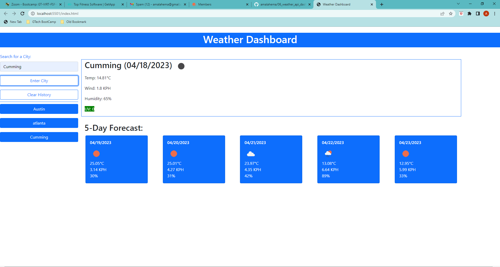

# 06 Server-Side APIs: Weather Dashboard

## 
## Table of contents
- Overview
    - The Challenge
    - Screenshot
    - Links
- My Approach
    - Code construction
    - Learnings
- Author
## Overview
### The Challenge
```
GIVEN a weather dashboard with form inputs
WHEN I search for a city
THEN I am presented with current and future conditions for that city and that city is added to the search history
WHEN I view current weather conditions for that city
THEN I am presented with the city name, the date, an icon representation of weather conditions, the temperature, the humidity, and the wind speed
WHEN I view future weather conditions for that city
THEN I am presented with a 5-day forecast that displays the date, an icon representation of weather conditions, the temperature, the wind speed, and the humidity
WHEN I click on a city in the search history
THEN I am again presented with current and future conditions for that city
```

## Screenshot

The following image shows the web application's appearance and functionality:



### Links
Github url - https://github.com/amalahema/06_weather_api_dashboard

## My Approach

### Code Construction

- API fetch ,Jquery & Javascript
- Html,css & Bootstrap

### Learnings

- How to Generate API key and use that in the fetch 
- How to Use query parameters to  search the weather of the current city
- How to use the data to get temperature, weather & wind from the API
- How to create a card body and elements 
- How to Get 5-day forecast and display in the separate container
- How to Save searched city history as the button and clear the history

